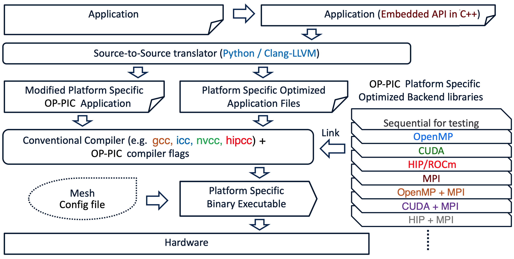

# OPP Code Generator

OP-PIC follows the automatic code-generation techniques and technologies in OP2 and OPS for generating on-node/distributed-memory parallelizations. 

An application written in OP-PIC will be parsed by the code-generator (using clang) and will build an abstract syntax tree (AST) of the code. 
Some examples of generated ASTs can be found in folder `OP-PIC/opp_translator/generated_ast`.

The AST facilitates us to easily traverse and collect information on the API calls, for example the arguments of `opp_par_loop`. 
The API information together with the elemental kernel functions forms an intermediate representation of the application.
These are then used to populate or modify code templates for specific parallelizations. 

The templates are written in Jinja2 (`OP-PIC/opp_translator/resources/templates/cpp`) and they are updated using Python (`OP-PIC/opp_translator/translator`). 

The system is also easily extensible where a new parallelization, or optimization could be added as a new template which can then be reused. 

Currently OP-PIC supports the generation of sequential(`seq`), OpenMP(`omp`), MPI(`mpi`), CUDA(`cuda`), HIP(`hip`) and their CUDA+MPI(`cuda_mpi`), HIP+MPI(`hip_mpi`) distributed memory parallelizations

## Requirements
 * Python >= 3.8

## Setup OP-PIC translator python environment (One time process)
Run `setup_venv.sh` (this will download the required libraries, including `libclang` and create the `opp_venv` python environment).

## Usage
`usage: opp-translator [-h] [-V] [-v] [-d] [-o OUT] [-c CONFIG] [-soa] [--suffix SUFFIX] [-I I] [-i I] [-D D] [--file_paths FILE_PATHS [FILE_PATHS ...]] [-t {seq,mpi,omp,cuda,hip}]`

 * Running `python3 $OPP_TRANSLATOR -v -I$OPP_PATH/include/ --file_paths <application_cpp_file_path>` will generate code for all the parallelizations implemented with OP-PIC.
 * If only one target parallelization is required, use argument `-t <parallelization>` to generate only the required files.
 * `cuda_mpi` and `hip_mpi` MPI implementations are embedded within its respective `cuda` and `hip` generated code, however the generated MPI related code is guarded against compilation issues when pursuing a non-mpi build.

## 

The user is required to implement, one or multiple files including OP-PIC DSL declarations, and kernels with arguments in the same order of the args of `opp_par_loop` or `opp_particle_move` loops.

Once the code-generator is invoked, the below files and folders will be generated.
 - `<application_file_name>_opp.cpp` - This is the code generated file of the user written application cpp file.
 - `seq`, `omp`, `mpi`, `cuda` and `hip` folders, including `opp_kernels.<cpp|cu>` and a loop kernel header file per unique `opp_par_loop` or `opp_particle_move` loop.

In addition to the regular `opp_decl_set`, `opp_decl_particle_set`, `opp_decl_map` and `opp_decl_dat` declarations, the code-generator is capable of identifying the hdf5 version of these API calls (`opp_decl_set_hdf5`, `opp_decl_particle_set_hdf5`, `opp_decl_map_hdf5` and `opp_decl_dat_hdf5`).

An example usage of hdf5 APIs can found in `OP-PIC/app_fempic`. 
To code-gen the hdf5 version, simply use `python3 $OPP_TRANSLATOR -v -I$OPP_PATH/include/ --file_paths fempic_hdf5.cpp`.